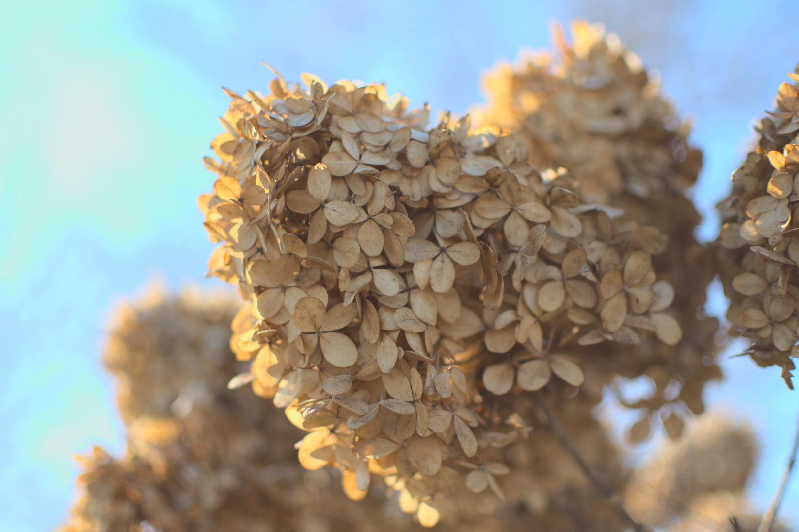

# bend
A small command line tool used to databend images for use in [glitch art](https://en.wikipedia.org/wiki/Glitch_art). It currently supports `.jpg` and `.bmp`. There is planned support for both `.raw` and `.png` data formats.

# Examples
## Before

## After

## Before

## After

